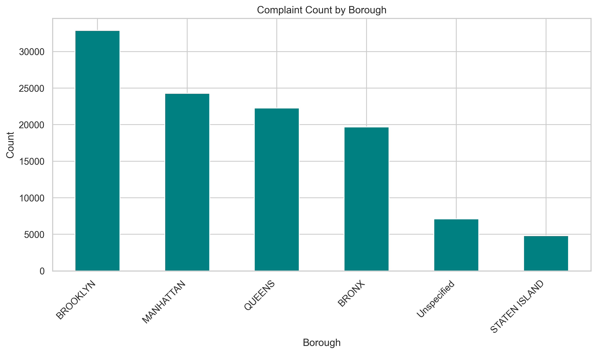
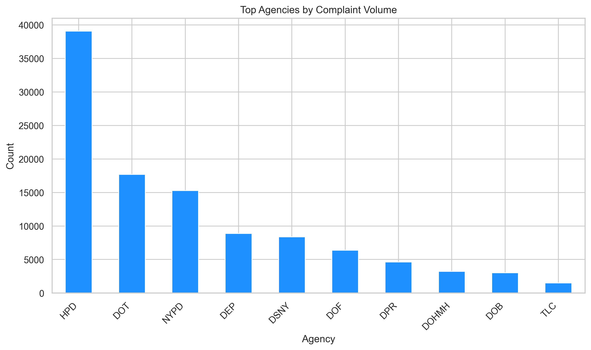
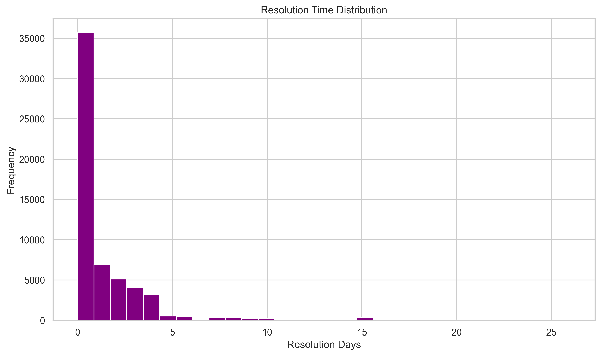
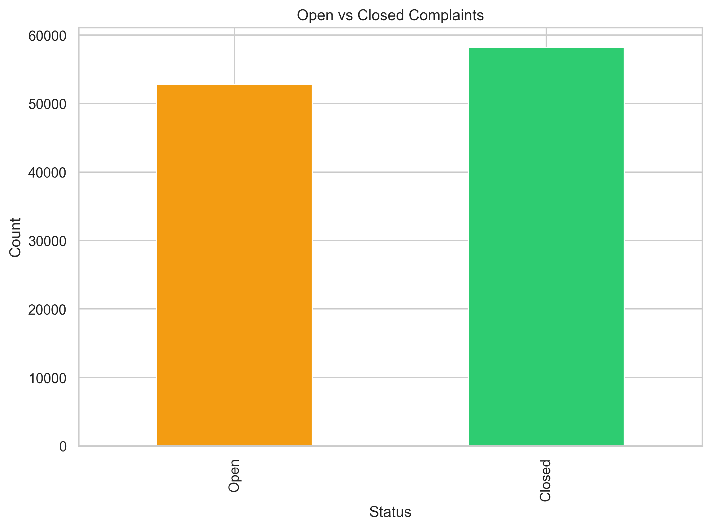

# NYC 311 Service Requests Analysis


  
</p>

A portfolio-ready data analysis project exploring NYC 311 service requests and the operational patterns behind public service demand.

## Project Summary

This project analyzes NYC 311 service request data to understand complaint patterns, city-level demand, agency response, and resolution behavior. The work follows a real-world data workflow: auditing data quality, cleaning and validating the dataset, engineering time-based features, visualizing trends, and summarizing findings in a way that is useful for business and operational decisions.

The aim is to present a clean and reproducible data project that shows analytical thinking, practical cleaning skills, and clear communication of findings.

---

## Why This Project Matters

NYC 311 data is a strong example of operational service data because it contains both meaningful insights and real-world quality issues. Missing values, unresolved complaints, and inconsistent dates are all common in public service datasets, and handling them correctly is an important part of the analysis.

This project demonstrates how to move from raw, messy data to business-friendly insights using a reproducible workflow.

---

## Dataset Overview

The dataset contains NYC 311 service requests with fields such as:

- complaint type
- agency and agency name
- borough and city
- created date and closed date
- status
- location and zip-related information

These variables allow the analysis to explore where complaints are concentrated, which departments receive the most requests, and how long complaints take to resolve.

---

## Key Insights

- A small number of complaint categories dominate the total volume.
- Agency workload is unevenly distributed across city departments.
- Borough-level complaint demand is highly concentrated.
- Most complaints are resolved quickly, while a smaller set remains open or takes much longer.
- The dataset is well suited for a portfolio project because it combines real-world complexity with clear business interpretation.

---

## Visual Highlights

<div align="center">
  
</div>

<div align="center">
  
</div>

<div align="center">
  
</div>

<div align="center">
  
</div>

---

## Workflow

1. Load the raw NYC 311 dataset
2. Audit missing values and data quality issues
3. Clean and validate the data
4. Engineer time-based features
5. Explore complaint trends and performance patterns
6. Summarize findings and recommendations
7. Export cleaned output for downstream analysis

---

## Technical Stack

- Python
- pandas
- NumPy
- matplotlib
- seaborn
- Jupyter Notebook

---

## Repository Structure

```text
NYC-311-Analysis/
├── data/
│   └── 311-service-requests.csv
├── visuals/
│   ├── agency_complaints.png
│   ├── borough_complaints.png
│   ├── complaints_by_day.png
│   ├── complaints_by_month.png
│   ├── open_vs_closed.png
│   ├── resolution_time_distribution.png
│   ├── top_complaints.png
│   └── top_complaint_types_pie.png
├── output/
│   └── 311_cleaned.parquet
├── 01_audit.ipynb
├── index.html
├── README.md
├── .gitignore
└── requirements.txt
```

## GitHub Pages / HTML Theme

This repository also includes a simple HTML landing page at `index.html` that gives the project a more presentation-style portfolio look.

To publish it as a GitHub Pages site:

1. Go to the repository on GitHub
2. Open Settings → Pages
3. Choose the `main` branch
4. Set the folder to `/root`
5. Save and wait for the page to deploy

Your project page will then be available at:

```text
https://Siavashrk33.github.io/NYC-311-Analysis/
```

---

## How to Run

Clone the project:

```bash
git clone https://github.com/Siavashrk33/NYC-311-Analysis.git
cd NYC-311-Analysis
```

Open the notebook:

```bash
jupyter notebook
```

Then open `01_audit.ipynb` and run the cells in order.

---

## Recommendations

The analysis suggests that city resources should be prioritized toward:

- recurring complaint types with the highest volume
- agencies with the largest operational demand
- boroughs showing concentrated service pressure
- complaint categories with slower resolution times

These insights can inform more effective resource allocation and service planning.

---

## Contact

- GitHub: https://github.com/Siavashrk33
- Instagram: [instagram.com/siavash_rko](https://www.instagram.com/siavash_rko?igsh=anBmcDQ2N3A5NGcz&utm_source=qr)
- X: [x.com/Siavashrk33](https://x.com/Siavashrk33)
- Email: siavashrko@gmail.com

---

## Final Note

This project demonstrates a realistic, professional data workflow from raw public data to cleaned output and business insight. It is designed to be strong enough for a portfolio, GitHub showcase, or job application in data analysis and analytics-related roles.
